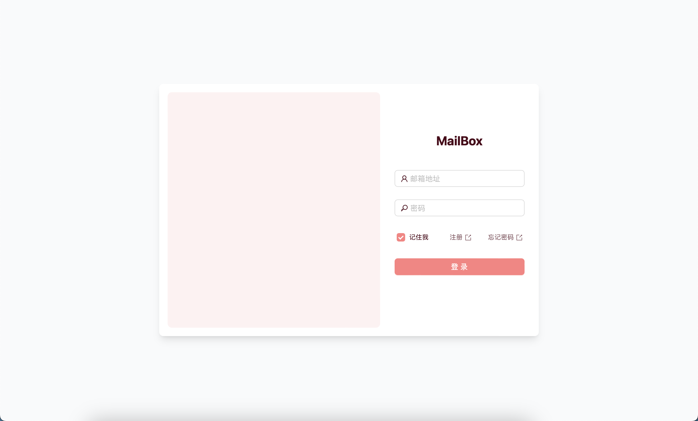

> This project was still in development, but basic functions have been implemented. You can deploy it to your own server and use it with your custom domain. If you have any questions, please feel free to open an issue.

> 该项目仍在开发中，但基本功能已经实现. 你可以将其部署到你自己的服务器并使用自定义域名. 如果你有任何问题，请随时提出 issue

# MailBox
MailBox is a web application that allows you to send and receive emails serverlessly and costlessly with your custom domain.

MailBox 是一个允许你使用自定义域名进行免费邮件收发的 Web 应用



#### Demo User: demo@leafyee.xyz

#### Demo Password: 123456

## Usage / 部署方法
### 1 Get MongoDB Atlas URI
获取 [MongoDB Atlas](https://www.mongodb.com/) 的数据库 URI

Create a new project in [MongoDB Atlas](https://www.mongodb.com/) and get the URI of the cluster. The URI should be like `mongodb+srv://<username>:<password>@xxxxxxx.xxxxxxxx.xxxxx?xxxx=xxxx&xxxx=xxxx`, remember to replace `<username>` and `<password>` with your own.

在 [MongoDB Atlas](https://www.mongodb.com/) 中创建一个新的项目并获取集群的 URI。URI 应该类似于 `mongodb+srv://<username>:<password>@xxxxxxx.xxxxxxxx.xxxxx?xxxx=xxxx&xxxx=xxxx`，请记得将 `<username>` 和 `<password>` 替换为你自己的

### 2 Get Resend API Key
获取 [Resend](https://resend.com/) 的 API key

Create a new project in [Resend](https://resend.com/), and create a new API key. Note that the domain you use in Resend should be the same as the domain you use in Cloudflare.

在 [Resend](https://resend.com/) 中创建一个新的项目并创建一个新的 API key。请注意你在 Resend 中使用的域名应该和你在 Cloudflare 中使用的域名相同

### 3 Deploy to Vercel
部署到 [Vercel](https://vercel.com/)

Deploy this `Next.js` project to `Vercel` with the following environment variables in `Vercel` or `.env` file.

在 `Vercel` 中部署这个 `Next.js` 项目，并在 `Vercel` 或 `.env` 文件中设置以下环境变量

| Variable | Description | Default | Required |
|:--------:|:-----------:|:-------:|:--------:|
| `RESEND_API_KEY` | API key of Resend | | Yes |
| `MONGODB_URI` | URI of MongoDB Atlas | | Yes |
| `PEER_AUTH_KEY` | For authenticating between Cloudflare Workers and Next.js | | Yes |
| `NEXT_PUBLIC_MAIL_SERVER` | The domain of your mail server, e.g. `mail.example.com` | | Yes |
| `REGISTRY_KEY` | If set, only users with this key can register | | |
| `NEXT_PUBLIC_REGISTRY_SET` | If `REGISTRY_KEY` is set, this should be set to `true` | | |

### 4 Config Workers Environment Variables
设置 Cloudflare Workers 的环境变量

Create `/workers/wrangler.toml` and add the following content. Remember to replace `<YOUR_NEXTJS_PROJECT_DOMAIN>` and `<YOUR_PEER_AUTH_KEY>` with your own.

创建 `/workers/wrangler.toml` 并添加以下内容, 请记得将 `<YOUR_NEXTJS_PROJECT_DOMAIN>` 和 `<YOUR_PEER_AUTH_KEY>` 替换为你自己的

```toml
#:schema node_modules/wrangler/config-schema.json
name = "mail"
main = "src/index.ts"
compatibility_date = "2024-08-01"
compatibility_flags = ["nodejs_compat"]

[vars]
NEXT_ENDPOINT = "https://<YOUR_NEXTJS_PROJECT_DOMAIN>/api/receive"
PEER_AUTH_KEY = "<YOUR_PEER_AUTH_KEY>"
```

### 5 Deploy Workers
部署 Cloudflare Workers

Run the following command to deploy the workers.

运行以下命令部署 Cloudflare Workers

```bash
cd ./workers # Change to workers directory to Workers project
bun install # Install dependencies
bunx wrangler login # Login to Cloudflare
bun run deploy # Deploy the workers
```

### 6 Config Cloudflare Mail route
设置 Cloudflare 的邮件路由

1. Go to your domain's Cloudflare dashboard.
2. Click on the `Email` tab.
3. Click on `Email Routing`.
4. Click on `Routing Rules`.
5. Set `Catch All` to forward all mail to the workers you just deployed.

1. 进入你的域名的 Cloudflare 控制台
2. 点击 `电子邮件`
3. 点击 `邮件路由`
4. 点击 `路由规则`
5. 设置 `Catch All` 为转发所有邮件到你刚刚部署的 Worker

## License
[GPL-3.0](./LICENSE)

## TODO
- [x] 身份验证和用户数据存储 (MongoDB)
- [x] 接收邮件功能 (Cloudflare Mail Workers -> Next.js -> MongoDB)
- [x] 注册功能 (服务端注册条件控制)
- [x] 单条邮件阅读组件
- [x] 发送邮件功能 (Resend)
- [x] 支持 Markdown 写邮件 (Marked)
- [ ] 个人资料页面 (记得游客账户不能修改)
- [ ] 夜间模式
- [ ] 已发送邮件页面
- [ ] 找回密码功能 (向备用邮箱发送验证码)
- [ ] AI 总结邮件内容生成邮件摘要 (Cloudflare Workers AI)
- [ ] 附件支持
- [ ] 邮件收藏
